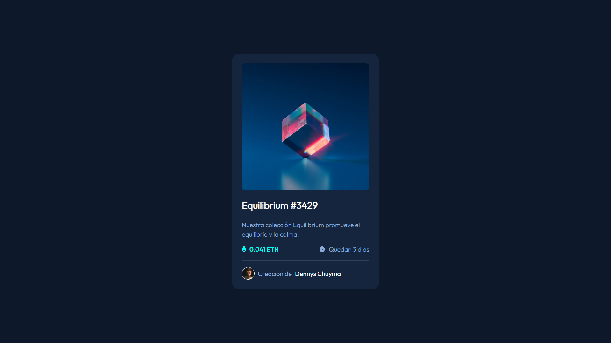

# Componente de tarjeta de vista previa NFT

Esta es una solución al [desafío del componente de tarjeta de vista previa de NFT en Frontend Mentor](https://www.frontendmentor.io/challenges/nft-preview-card-component-SbdUL_w0U).

## Tabla de contenido

- [Resumen](#resumen)
  - [El reto](#el-reto)
  - [Captura de pantalla](#captura-de-pantalla)
  - [Enlaces](#enlaces)
- [Mi proceso](#mi-proceso)
  - [Construido con](#construido-con)
  - [Que aprendí](#que-aprendí)
  - [Desarrollo continuo](#desarrollo-continuo)
  - [Recursos útiles](#recursos-útiles)
- [Autor](#autor)
- [Agradecimientos](#agradecimientos)


## Visión general

### El reto

Los usuarios deben ser capaces de:

- Ver el diseño óptimo según el tamaño de pantalla de su dispositivo
- Ver estados de desplazamiento para elementos interactivos

### Captura de pantalla




### Enlaces

- URL de la solución: [https://github.com/denn-c/tarjeta-de-vista-previa-nft](https://github.com/denn-c/tarjeta-de-vista-previa-nft)
- URL del sitio en vivo: [https://denn-c.github.io/tarjeta-de-vista-previa-nft/](https://denn-c.github.io/tarjeta-de-vista-previa-nft/)

## Mi proceso

### Construido con

- Marcado HTML5 semántico
- Propiedades personalizadas de CSS
- Caja flexible

### Que aprendí

Diseñar, crear y mantener sitios web, proporcionando en el proceso un portal online coherente y fácil de usar para los clientes, compañeros de trabajo y otras partes implicadas. Incorporan contenido, imágenes, gráficos, vídeos y otras utilidades para crear sitios atractivos con los que los usuarios querrán interactuar.  

Fragmentos de código con mayor relevancia en este proyecto.

**HTML**

```html
<section class="main__section">
  
  <p class="main__date">Quedan 3 días</p>
</section>
```
**CSS**
```css

.main__promo,
.main__section{
  display: flex;
  justify-content: space-between;
}
.main__date{
  color: var(--Soft-blue);
}
```
### Desarrollo continuo

- **Crear la codificación que da vida a un sitio web** y ayudar a que funcione según lo exigido por el host.  
- **Diseñar no solo el aspecto de un sitio web**, sino también su funcionamiento para el usuario final.  
- **Responsabilizarse de qué funciones se pueden realizar** cuando un usuario llega a la página web.  
- **Utilizar los últimos mecanismos y aplicaciones** para que el sitio funcione de la forma más fluida y eficiente posible.  
- **Probar sitios nuevos y existentes** y corregir posibles errores que puedan surgir.  

### Recursos útiles

- [Conceptos básicos de HTML](https://developer.mozilla.org/es/docs/Learn/Getting_started_with_the_web/HTML_basics) - Esto me ayudó en escoger las etiquetas necesarias para maquetado del HTML. Me gustó mucho este patrón y lo usaré en el futuro.
- [CSS básico](https://developer.mozilla.org/es/docs/Learn/Getting_started_with_the_web/CSS_basics)  Esto me ayudó en escoger las etiquetas necesarias para maquetado del CSS. Me gustó mucho este patrón y lo usaré en el futuro.

## Autor

- Facebook - [Dennys Chuyma](https://www.facebook.com/dennys.chuyma)
- Twitter - [denn](https://twitter.com/dennyschuyma)
- Mentor de frontend - [@denn-c](https://www.frontendmentor.io/profile/denn-c)

## Agradecimientos

Mis agradecimiento a los creadores de contenido de la comunidad de YouTube de indole educativo gracias a ellos fue posible la resolución de este desafió
